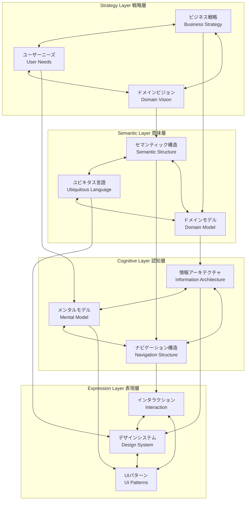
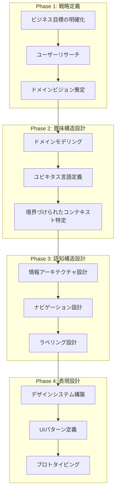
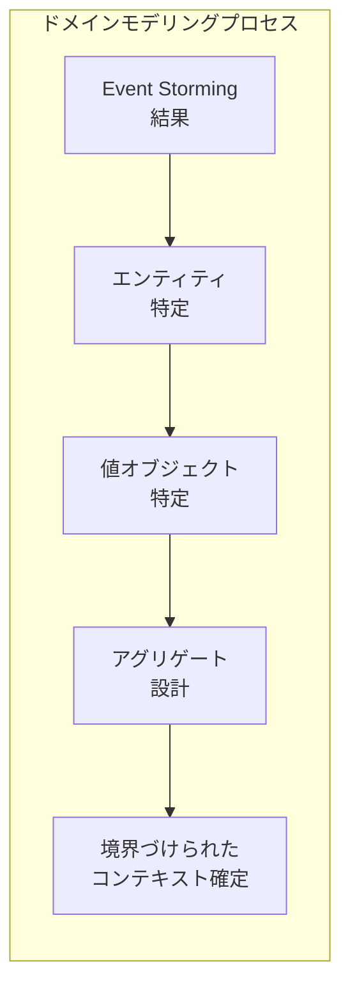
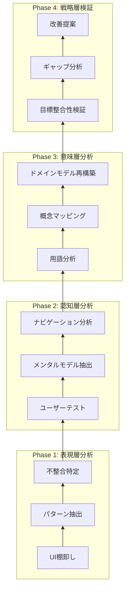
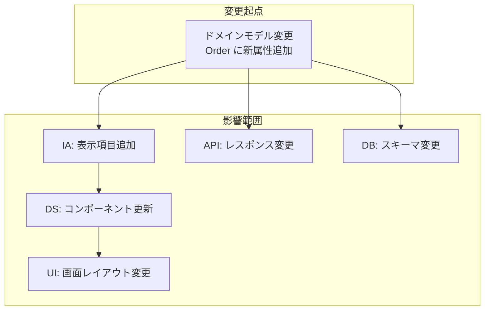
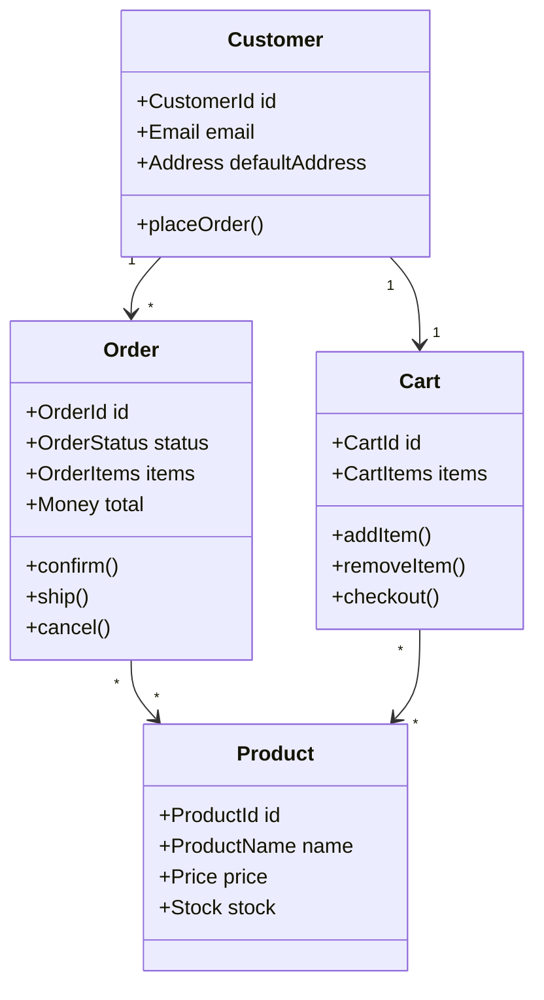
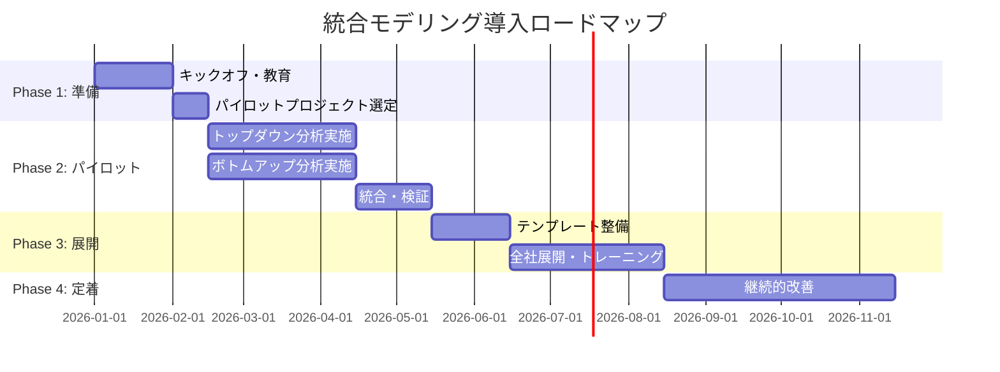

#  統合モデリング運用手法
## トップダウン・ボトムアップ両方向からの実践ガイド

**Version 1.0**
**Date: 2026-01-25**

---

## 目次

1. [序論](#1-序論)
2. [統合モデルのアーキテクチャ](#2-統合モデルのアーキテクチャ)
3. [トップダウン分析手法](#3-トップダウン分析手法)
4. [ボトムアップ分析手法](#4-ボトムアップ分析手法)
5. [双方向変換の実践](#5-双方向変換の実践)
6. [ツールとテンプレート](#6-ツールとテンプレート)
7. [ケーススタディ](#7-ケーススタディ)
8. [実装ガイドライン](#8-実装ガイドライン)
9. [組織導入のロードマップ](#9-組織導入のロードマップ)

---

## 1. 序論

### 1.1 本ドキュメントの目的

本ドキュメントは、「統合モデリング理論」で提案されたUnified Semantic Architecture（統合意味アーキテクチャ）を実務に適用するための具体的な手法を提供する。

**対象読者**：
- プロダクトマネージャー
- UXデザイナー / 情報アーキテクト
- ソフトウェアエンジニア / アーキテクト
- ビジネスアナリスト

### 1.2 統合モデルの概要

```
┌─────────────────────────────────────────────────────────────┐
│                     統合意味アーキテクチャ                      │
├─────────────────────────────────────────────────────────────┤
│  Strategy Layer   │ ビジネス戦略 ← ユーザーニーズ ← ドメインビジョン │
├─────────────────────────────────────────────────────────────┤
│  Semantic Layer   │ ドメインモデル ← セマンティック構造            │
├─────────────────────────────────────────────────────────────┤
│  Cognitive Layer  │ 情報アーキテクチャ ← メンタルモデル            │
├─────────────────────────────────────────────────────────────┤
│  Expression Layer │ デザインシステム ← UIパターン                │
└─────────────────────────────────────────────────────────────┘
                    ↑                    ↓
              トップダウン            ボトムアップ
```

### 1.3 分析アプローチの選択

| シナリオ | 推奨アプローチ |
|---|---|
| 新規プロダクト開発 | トップダウン |
| レガシーシステムのリデザイン | ボトムアップ |
| 機能追加・改善 | 双方向 |
| ユーザビリティ問題の解決 | ボトムアップ → トップダウン検証 |
| ビジネス要件変更 | トップダウン → ボトムアップ影響分析 |

---

## 2. 統合モデルのアーキテクチャ

### 2.1 4層アーキテクチャの詳細



### 2.2 層間の変換関係

| 変換 | 入力 | 出力 | 担当者 |
|---|---|---|---|
| Strategy → Semantic | ビジネス目標、ユーザーニーズ | ドメインモデル、概念定義 | BA, ドメインエキスパート |
| Semantic → Cognitive | ドメインモデル、用語体系 | 情報構造、ナビゲーション | IA, UXデザイナー |
| Cognitive → Expression | 情報構造、メンタルモデル | UIコンポーネント、パターン | UIデザイナー, フロントエンド |

### 2.3 セマンティック・ブリッジの概念

**セマンティック・ブリッジ**とは、各層間で意味（セマンティクス）を一貫して伝達するための仕組みである。

```
ドメイン概念 "注文 (Order)"
        │
        ▼ [セマンティック・ブリッジ]
IA ラベル "ご注文"
        │
        ▼ [セマンティック・ブリッジ]
UIコンポーネント <OrderCard />
        │
        ▼ [セマンティック・ブリッジ]
デザイントークン --color-order-status-*
```

---

## 3. トップダウン分析手法

### 3.1 概要

トップダウン分析は、戦略層から表現層に向かって順次詳細化を進める手法である。新規プロダクト開発や大規模リニューアルに適している。



### 3.2 Phase 1: 戦略定義

#### 3.2.1 ビジネス目標の明確化

**入力**:
- 経営戦略文書
- 市場分析レポート
- 競合分析

**プロセス**:

```
1. ビジネス目標の列挙
   └── 定量目標（売上、ユーザー数、コンバージョン率など）
   └── 定性目標（ブランドイメージ、顧客満足度など）

2. 優先順位付け
   └── MoSCoW法（Must/Should/Could/Won't）
   └── 影響度×実現可能性マトリクス

3. 成功指標の定義
   └── KPI設定
   └── 測定方法の決定
```

**出力**: ビジネス目標ステートメント

**テンプレート**:
```markdown
## ビジネス目標ステートメント

### 主要目標
[プロダクト名]は、[ターゲットユーザー]が[解決したい課題]を
解決することで、[ビジネス成果]を達成する。

### 定量目標
- 目標1: [指標] を [期間] で [数値] に到達
- 目標2: ...

### 定性目標
- 目標1: [説明]
- 目標2: ...

### 成功指標
| KPI | 現状 | 目標 | 測定方法 |
|-----|------|------|----------|
| ... | ...  | ...  | ...      |
```

#### 3.2.2 ユーザーリサーチ

**手法**:

| 手法 | 目的 | 成果物 |
|---|---|---|
| インタビュー | ユーザーの文脈理解 | インタビューノート |
| 観察調査 | 実際の行動把握 | 行動パターン分析 |
| サーベイ | 定量的ニーズ把握 | 統計データ |
| ペルソナ作成 | ユーザー像の共有 | ペルソナシート |
| ジャーニーマップ | 体験全体の可視化 | カスタマージャーニーマップ |

**ペルソナテンプレート**:
```markdown
## ペルソナ: [名前]

### 基本情報
- 年齢: [年齢]
- 職業: [職業]
- 技術リテラシー: [高/中/低]

### 目標と動機
- 主要目標: [説明]
- 動機: [説明]

### 課題とフラストレーション
- 課題1: [説明]
- 課題2: [説明]

### 行動パターン
- [パターン1]
- [パターン2]

### 使用する用語
- [ユーザーが使う言葉] = [システム内の概念]
```

#### 3.2.3 ドメインビジョン策定

**Event Storming の活用**:

Event Storming は、ドメインビジョンを策定するための協働ワークショップ手法である。

```
1. ドメインイベントの洗い出し（オレンジ付箋）
   └── 「〜された」という過去形で表現
   └── 時系列に並べる

2. コマンドの特定（青付箋）
   └── イベントを引き起こすアクション
   └── 「〜する」という動詞形

3. アクターの特定（黄色付箋）
   └── コマンドを実行する人/システム

4. アグリゲートの特定（黄色大付箋）
   └── 関連するイベントとコマンドをグループ化

5. 境界づけられたコンテキストの発見（線引き）
   └── 言葉の意味が変わる境界を特定
```

### 3.3 Phase 2: 意味構造設計

#### 3.3.1 ドメインモデリング

**プロセス**:



**エンティティ特定の基準**:
- 固有のアイデンティティを持つか？
- ライフサイクルを持つか？
- 時間経過で状態が変化するか？

**値オブジェクト特定の基準**:
- アイデンティティは重要でないか？
- 不変であるべきか？
- 属性の組み合わせで定義されるか？

**ドメインモデル記述テンプレート**:
```markdown
## エンティティ: [名前]

### 識別子
- タイプ: [UUID / 連番 / 自然キー]
- 形式: [説明]

### 属性
| 属性名 | 型 | 説明 | 制約 |
|--------|-----|------|------|
| ...    | ... | ...  | ...  |

### 振る舞い
- [メソッド名]: [説明]

### 状態遷移
```
[状態A] --[イベント]--> [状態B]
```

### 不変条件
- [条件1]
- [条件2]

### 関連
- [関連エンティティ]: [関連タイプ] ([多重度])
```

#### 3.3.2 ユビキタス言語定義

**ユビキタス言語辞書テンプレート**:
```markdown
## ユビキタス言語辞書

### 用語定義

#### [用語名]
- **定義**: [明確な定義]
- **コンテキスト**: [どの境界づけられたコンテキストで使用するか]
- **同義語**: [ある場合]
- **反意語**: [ある場合]
- **関連用語**: [関連する用語]
- **使用例**: [文脈での使用例]
- **NG例**: [誤った使用例]

### コンテキスト別用語マッピング

| ドメイン用語 | コンテキストA | コンテキストB |
|--------------|---------------|---------------|
| ...          | ...           | ...           |
```

### 3.4 Phase 3: 認知構造設計

#### 3.4.1 情報アーキテクチャ設計

**ドメインモデルからIAへの変換マトリクス**:

| ドメイン要素 | IA要素 | 変換ルール |
|---|---|---|
| エンティティ | コンテンツタイプ | 主要エンティティ = ページ/セクション |
| 属性 | フィールド/ラベル | 属性 = 表示項目 |
| 関連 | リンク/ナビゲーション | 関連 = 導線 |
| アグリゲート | 情報グループ | アグリゲート = カード/セクション |
| 状態 | ステータス表示 | 状態 = バッジ/フィルタ |

**サイトマップテンプレート**:
```markdown
## サイトマップ

### 階層構造

```
[ホーム]
├── [セクションA]
│   ├── [ページA-1]
│   │   └── [サブページA-1-1]
│   └── [ページA-2]
├── [セクションB]
│   ├── [ページB-1]
│   └── [ページB-2]
└── [セクションC]
```

### ページ-ドメイン対応表

| ページ | 対応ドメイン概念 | 主要機能 |
|--------|------------------|----------|
| ...    | ...              | ...      |
```

#### 3.4.2 ラベリング設計

**ラベリング原則**:

1. **ユビキタス言語との一貫性**: ドメイン用語をそのまま使用
2. **ユーザー言語との橋渡し**: ユーザーリサーチで発見した言葉との対応
3. **一貫性**: 同じ概念には同じラベルを使用
4. **明確性**: 曖昧さを排除

**ラベリングマトリクス**:
```markdown
## ラベリングマトリクス

| ドメイン用語 | ユーザー用語 | UIラベル | 理由 |
|--------------|--------------|----------|------|
| Order        | 買い物/購入  | ご注文    | ユーザー調査でこの言葉が最も親しみやすかった |
| Product      | 商品/アイテム | 商品      | 一般的で理解しやすい |
| Cart         | カゴ/かご    | カート    | EC慣習として定着 |
```

### 3.5 Phase 4: 表現設計

#### 3.5.1 デザインシステム構築

**セマンティック・デザイントークンの設計**:

```css
/* 従来のデザイントークン */
--color-blue-500: #3b82f6;
--spacing-4: 1rem;

/* セマンティック・デザイントークン */
/* ドメイン概念と紐づけ */
--color-order-status-pending: #f59e0b;
--color-order-status-completed: #10b981;
--color-order-status-cancelled: #ef4444;

--spacing-card-internal: var(--spacing-4);
--spacing-aggregate-gap: var(--spacing-6);
```

**コンポーネント-ドメイン対応表**:
```markdown
## コンポーネント-ドメイン対応表

| コンポーネント | 対応ドメイン概念 | 責務 |
|----------------|------------------|------|
| `<OrderCard />` | Order (Entity) | 注文の要約表示 |
| `<OrderStatusBadge />` | Order.status (Attribute) | 状態の視覚化 |
| `<ProductList />` | Product[] (Collection) | 商品一覧表示 |
| `<CartSummary />` | Cart (Aggregate) | カート全体の表示 |
```

---

## 4. ボトムアップ分析手法

### 4.1 概要

ボトムアップ分析は、既存のUI/実装から上位の概念構造を逆算する手法である。レガシーシステムの分析やユーザビリティ問題の根本原因特定に適している。



### 4.2 Phase 1: 表現層分析

#### 4.2.1 UI棚卸し

**目的**: 既存UIのすべてのコンポーネント、パターン、スタイルを収集・分類

**手法**:

```markdown
## UI棚卸しシート

### ページ: [ページ名]

#### コンポーネント一覧
| コンポーネント | 出現回数 | バリエーション | 備考 |
|----------------|----------|----------------|------|
| ボタン         | 15       | 3種類          | スタイル不統一 |
| カード         | 8        | 2種類          | 一貫性あり |
| ...            | ...      | ...            | ...  |

#### 使用ラベル一覧
| ラベル | 場所 | 意味 | 備考 |
|--------|------|------|------|
| 注文   | ヘッダー | 注文履歴へのリンク | - |
| ご注文 | フッター | 同上 | 表記揺れ |
| ...    | ...  | ...  | ...  |
```

#### 4.2.2 パターン抽出

**UI Audit Matrix**:

```markdown
## UI Audit Matrix

### パターン分類

| パターンカテゴリ | インスタンス数 | 一貫性スコア (1-5) | 問題点 |
|------------------|----------------|---------------------|--------|
| ナビゲーション   | 5              | 2                   | 位置が不統一 |
| フォーム         | 12             | 4                   | 概ね一貫 |
| リスト表示       | 8              | 3                   | カード/テーブル混在 |
| ...              | ...            | ...                 | ...    |
```

#### 4.2.3 不整合特定

**不整合タイプ**:

| タイプ | 説明 | 例 |
|---|---|---|
| 視覚的不整合 | 同じ機能で異なる見た目 | ボタンの色が場所により異なる |
| ラベル不整合 | 同じ概念に異なる名前 | 「注文」「ご注文」「オーダー」 |
| インタラクション不整合 | 同じ操作で異なる反応 | 削除確認ダイアログの有無 |
| 構造不整合 | 同じデータの異なる表示構造 | 一覧と詳細で属性の順序が異なる |

### 4.3 Phase 2: 認知層分析

#### 4.3.1 ユーザーテスト

**タスク分析シート**:

```markdown
## タスク分析シート

### タスク: [タスク名]

#### 期待パス
1. [ステップ1]
2. [ステップ2]
3. ...

#### 観察結果

| 参加者 | 実際のパス | 迷った箇所 | 発話内容 | 完了時間 |
|--------|------------|------------|----------|----------|
| P1     | 1→3→2→4   | ステップ2  | "これどこ？" | 45秒 |
| P2     | 1→2→3→4   | なし       | -        | 20秒 |
| ...    | ...        | ...        | ...      | ...  |

#### 発見事項
- [発見1]
- [発見2]
```

#### 4.3.2 メンタルモデル抽出

**カードソーティング結果分析**:

```markdown
## カードソーティング分析

### 参加者のグルーピング傾向

| 概念 | 参加者の分類傾向 | システムの現状分類 | 乖離度 |
|------|------------------|---------------------|--------|
| 注文履歴 | アカウント関連(80%) | ショッピング | 高 |
| お気に入り | アカウント関連(60%) | ショッピング | 中 |
| ...  | ...              | ...                 | ...    |

### メンタルモデル図

```
[ユーザーのメンタルモデル]
├── 私のもの
│   ├── 注文履歴
│   ├── お気に入り
│   └── ポイント
└── 買い物
    ├── 商品を探す
    └── カート

[システムの現状]
├── ショッピング
│   ├── 商品
│   ├── 注文履歴  ← 乖離
│   └── お気に入り ← 乖離
└── アカウント
    └── ポイント
```
```

### 4.4 Phase 3: 意味層分析

#### 4.4.1 用語分析

**用語マイニング**:

```markdown
## 用語分析

### ソース別用語抽出

| ソース | 抽出用語 | 出現頻度 | 意味 |
|--------|----------|----------|------|
| UI     | 注文     | 15       | 購入手続き |
| UI     | ご注文   | 8        | 同上（敬称） |
| コード | Order    | 50       | 注文エンティティ |
| API    | purchase | 20       | 購入アクション |
| DB     | orders   | 1        | 注文テーブル |

### 用語の不一致マップ

```
UI          コード        DB          API
─────────────────────────────────────────
注文    →   Order     →  orders   →  purchase
ご注文  →   Order     →  orders   →  -
購入    →   Purchase  →  -        →  purchase
```
```

#### 4.4.2 概念マッピング

**リバースエンジニアリングによるドメインモデル抽出**:

```markdown
## 概念マッピング

### テーブル → エンティティ変換

| テーブル | 推定エンティティ | 推定属性 | 問題点 |
|----------|------------------|----------|--------|
| orders   | Order            | id, user_id, status, created_at | statusが文字列 |
| order_items | OrderItem      | order_id, product_id, quantity | 価格情報なし |
| ...      | ...              | ...      | ...    |

### API → ユースケース変換

| エンドポイント | HTTPメソッド | 推定ユースケース |
|----------------|--------------|------------------|
| /orders        | POST         | 注文を作成する |
| /orders/{id}   | GET          | 注文を取得する |
| /orders/{id}   | PUT          | 注文を更新する |
| ...            | ...          | ...              |
```

### 4.5 Phase 4: 戦略層検証

#### 4.5.1 目標整合性検証

**整合性チェックリスト**:

```markdown
## 戦略整合性検証

### ビジネス目標との整合性

| ビジネス目標 | 現状の実現度 | 阻害要因 | 改善案 |
|--------------|--------------|----------|--------|
| コンバージョン率向上 | 2/5 | チェックアウトフローの複雑さ | フロー簡素化 |
| リピート率向上 | 3/5 | 再注文機能の発見しづらさ | ナビゲーション改善 |
| ...          | ...          | ...      | ...    |

### ユーザーニーズとの整合性

| ユーザーニーズ | 現状の対応度 | ギャップ | 改善案 |
|----------------|--------------|----------|--------|
| 注文状況の把握 | 3/5 | リアルタイム性不足 | プッシュ通知 |
| ...            | ...          | ...      | ...    |
```

---

## 5. 双方向変換の実践

### 5.1 変換の原則

**セマンティック保存原則**:

各変換において、意味（セマンティクス）は保存されなければならない。

```
ドメイン概念の意味 ≡ IAラベルの意味 ≡ UIコンポーネントの表現する意味
```

**変換の可逆性**:

トップダウン変換とボトムアップ変換は、可逆的であるべきである。

```
Strategy → Semantic → Cognitive → Expression
    ↑                                  │
    └──────────────────────────────────┘
           検証ループ
```

### 5.2 トレーサビリティマトリクス

**フルスタック・トレーサビリティ**:

```markdown
## トレーサビリティマトリクス

| ビジネス目標 | ユーザーニーズ | ドメイン概念 | IA要素 | UIコンポーネント |
|--------------|----------------|--------------|--------|------------------|
| 売上向上 | 簡単に購入したい | Order, Cart | チェックアウトフロー | `<CheckoutWizard />` |
| リピート率 | 再注文を楽にしたい | ReOrder | 再注文セクション | `<ReOrderButton />` |
| ...        | ...            | ...          | ...    | ...              |
```

### 5.3 変更影響分析

**変更波及マップ**:



**影響分析チェックリスト**:

```markdown
## 変更影響分析

### 変更内容
- [変更の説明]

### 影響を受けるレイヤ

| レイヤ | 影響有無 | 具体的な変更 | 工数見積もり |
|--------|----------|--------------|--------------|
| Strategy | いいえ | - | - |
| Semantic | はい | Order エンティティに属性追加 | 2h |
| Cognitive | はい | 注文詳細画面に項目追加 | 1h |
| Expression | はい | OrderCard コンポーネント更新 | 3h |

### 関連成果物の更新

| 成果物 | 更新内容 |
|--------|----------|
| ユビキタス言語辞書 | 新属性の定義追加 |
| IA仕様書 | 画面仕様更新 |
| デザイントークン | 必要に応じて追加 |
| コンポーネントライブラリ | OrderCard 更新 |
```

---

## 6. ツールとテンプレート

### 6.1 Event Storming ボード

```
┌─────────────────────────────────────────────────────────────────┐
│                    Event Storming ボード                         │
├─────────────────────────────────────────────────────────────────┤
│                                                                 │
│  [オレンジ]     [青]        [黄色]      [紫]       [ピンク]      │
│  ドメイン      コマンド     アクター    ポリシー    外部システム   │
│  イベント                                                        │
│                                                                 │
│  ┌────────┐  ┌────────┐  ┌────────┐  ┌────────┐  ┌────────┐   │
│  │注文が  │  │注文する│  │顧客    │  │在庫確認│  │決済    │   │
│  │作成された│ │        │  │        │  │後に注文│  │システム│   │
│  └────────┘  └────────┘  └────────┘  └────────┘  └────────┘   │
│                                                                 │
│  時間軸 ───────────────────────────────────────────────────>   │
│                                                                 │
└─────────────────────────────────────────────────────────────────┘
```

### 6.2 統合モデリングキャンバス

```markdown
# 統合モデリングキャンバス

## 1. 戦略層
┌─────────────────────────────────────────────────────────────┐
│ ビジネス目標          │ ユーザーニーズ        │ ドメインビジョン │
│                      │                      │                │
│ • [目標1]            │ • [ニーズ1]          │ • [ビジョン]   │
│ • [目標2]            │ • [ニーズ2]          │                │
└─────────────────────────────────────────────────────────────┘

## 2. 意味層
┌─────────────────────────────────────────────────────────────┐
│ 主要エンティティ      │ ユビキタス言語        │ 境界コンテキスト │
│                      │                      │                │
│ • [Entity1]          │ • [用語1] = [定義]   │ • [Context1]   │
│ • [Entity2]          │ • [用語2] = [定義]   │ • [Context2]   │
└─────────────────────────────────────────────────────────────┘

## 3. 認知層
┌─────────────────────────────────────────────────────────────┐
│ 情報構造              │ メンタルモデル        │ ナビゲーション   │
│                      │                      │                │
│ • [カテゴリ1]        │ • [ユーザー認知1]    │ • [導線1]      │
│ • [カテゴリ2]        │ • [ユーザー認知2]    │ • [導線2]      │
└─────────────────────────────────────────────────────────────┘

## 4. 表現層
┌─────────────────────────────────────────────────────────────┐
│ デザイントークン      │ コンポーネント        │ UIパターン      │
│                      │                      │                │
│ • --color-*          │ • <Component1 />     │ • [パターン1]   │
│ • --spacing-*        │ • <Component2 />     │ • [パターン2]   │
└─────────────────────────────────────────────────────────────┘
```

### 6.3 ツールスタック推奨

| 用途 | ツール | 統合ポイント |
|---|---|---|
| Event Storming | Miro, FigJam | ドメインイベントの洗い出し |
| ドメインモデリング | PlantUML, Mermaid | コードとの同期 |
| IA設計 | Figma, XD, Penpot | ワイヤーフレーム作成 |
| デザインシステム | Figma + Storybook | コンポーネント管理 |
| デザイントークン | Style Dictionary, Tokens Studio, Terrazzo | W3C仕様準拠のトークン管理・変換 |
| DSドキュメント | zeroheight, Supernova, Knapsack | デザインシステムドキュメンテーション |
| トレーサビリティ | Notion, Confluence | マトリクス管理 |
| コード生成 | OpenAPI, GraphQL | スキーマ駆動開発 |

### 6.4 デザインシステム構築の選択肢

#### 6.4.1 主要なアプローチ比較

| アプローチ | 提唱者/出典 | 特徴 | 適合状況 |
|---|---|---|---|
| **Atomic Design** | Brad Frost | 化学メタファー（Atoms→Pages） | コンポーネント階層の可視化に強い |
| **EightShapes方式** | Nathan Curtis | ガバナンス重視、チームモデル定義 | 大規模組織、複数プロダクト |
| **Kholmatova方式** | Alla Kholmatova | パターン言語、デザイン原則重視 | 一貫性と進化の両立 |
| **Design Tokens中心** | Jina Anne (W3C DTCG) | クロスプラットフォーム変数管理 | マルチプラットフォーム展開 |

#### 6.4.2 ガバナンスモデルの選択（Nathan Curtis）

| モデル | 説明 | メリット | デメリット | 推奨状況 |
|---|---|---|---|---|
| **Centralized** | 専任チームが全管理 | 一貫性が高い、意思決定が早い | 現場ニーズ反映が遅れがち | 小〜中規模、新規構築時 |
| **Federated** | 各チーム代表が共同管理 | 現場ニーズ反映、採用されやすい | 時間分散、優先度競合 | 大規模、多様なプロダクト |
| **Standalone** | 各チーム独立管理 | 自由度が高い、迅速な対応 | 一貫性の欠如 | 独立性の高いプロダクト |

#### 6.4.3 Design Tokens設計（W3C DTCG仕様準拠）

```json
{
  "color": {
    "$type": "color",
    "primary": {
      "$value": "#3b82f6",
      "$description": "主要アクションカラー"
    },
    "order": {
      "status": {
        "pending": {
          "$value": "#f59e0b",
          "$description": "注文確認待ち - ドメイン: Order.status"
        },
        "confirmed": {
          "$value": "#10b981",
          "$description": "注文確定 - ドメイン: Order.status"
        }
      }
    }
  },
  "spacing": {
    "$type": "dimension",
    "card-internal": {
      "$value": "1rem",
      "$description": "カード内余白 - Aggregate境界を視覚化"
    }
  }
}
```

**セマンティック・トークン設計原則**（統合モデル独自）:
1. ドメイン概念との対応関係を`$description`に明記
2. グローバル→セマンティック→コンポーネントの3層構造
3. 各層でドメイン語彙との紐付けを維持

---

## 7. ケーススタディ

### 7.1 ECサイトの統合モデリング

#### 7.1.1 戦略層

**ビジネス目標**:
- コンバージョン率の向上（現状2% → 目標3%）
- カート放棄率の低減（現状70% → 目標50%）

**ユーザーニーズ**:
- 商品を素早く見つけたい
- 購入手続きを簡単に済ませたい
- 注文状況を把握したい

#### 7.1.2 意味層

**主要エンティティ**:



**ユビキタス言語抜粋**:

| 用語 | 定義 |
|---|---|
| 注文 (Order) | 顧客が商品の購入を確定した取引。作成後は「確認中」「発送済み」「配達完了」「キャンセル」の状態を持つ |
| カート (Cart) | 顧客が購入を検討している商品の一時的な保管場所。注文確定まで自由に追加・削除が可能 |
| チェックアウト | カートの内容を注文に変換するプロセス。配送先、支払い方法の選択を含む |

#### 7.1.3 認知層

**IAラベリング**:

| ドメイン用語 | UIラベル | 理由 |
|---|---|---|
| Order | ご注文 | 敬意を表す日本語表現 |
| Cart | カート | EC慣習として定着 |
| Checkout | ご注文手続き | プロセス感を表現 |
| OrderStatus.CONFIRMED | 注文確認済み | ユーザー視点の表現 |
| OrderStatus.SHIPPED | 発送済み | 配送状況を明示 |

**ナビゲーション構造**:

```
[ヘッダー]
├── [ロゴ] → ホーム
├── [検索バー]
├── [カテゴリナビ]
│   ├── カテゴリA
│   └── カテゴリB
├── [カートアイコン] → カート
└── [アカウント]
    ├── ご注文履歴 → Order一覧
    ├── お気に入り
    └── アカウント設定
```

#### 7.1.4 表現層

**セマンティック・デザイントークン**:

```css
/* 注文ステータス */
--color-order-status-confirmed: #3b82f6;  /* 青: 確認済み */
--color-order-status-shipped: #8b5cf6;    /* 紫: 発送済み */
--color-order-status-delivered: #10b981;  /* 緑: 配達完了 */
--color-order-status-cancelled: #ef4444;  /* 赤: キャンセル */

/* カート */
--color-cart-badge: #ef4444;              /* 赤: 注目を引く */
--spacing-cart-item-gap: var(--spacing-4);
```

**コンポーネント対応**:

| コンポーネント | ドメイン概念 | 責務 |
|---|---|---|
| `<ProductCard />` | Product | 商品情報の表示 |
| `<CartDrawer />` | Cart | カート内容の表示と操作 |
| `<CartItem />` | CartItem | 個別商品の表示 |
| `<CheckoutWizard />` | Checkout Process | 注文手続きのガイド |
| `<OrderCard />` | Order | 注文要約の表示 |
| `<OrderStatusBadge />` | Order.status | 状態の視覚化 |

---

## 8. 実装ガイドライン

### 8.1 コード構成

**ディレクトリ構造**:

```
src/
├── domain/                  # 意味層
│   ├── models/
│   │   ├── order.ts
│   │   ├── product.ts
│   │   └── cart.ts
│   ├── services/
│   └── events/
├── application/             # アプリケーション層
│   ├── usecases/
│   └── queries/
├── infrastructure/          # インフラ層
│   ├── repositories/
│   └── api/
└── presentation/            # 表現層
    ├── design-system/
    │   ├── tokens/
    │   │   ├── colors.ts
    │   │   └── spacing.ts
    │   └── components/
    │       ├── OrderCard/
    │       ├── ProductCard/
    │       └── CartDrawer/
    ├── pages/
    └── navigation/
```

### 8.2 命名規約

**一貫性のある命名**:

| 層 | 命名規則 | 例 |
|---|---|---|
| ドメインモデル | PascalCase, 名詞 | `Order`, `Product`, `CartItem` |
| ユースケース | camelCase, 動詞+名詞 | `placeOrder`, `addToCart` |
| コンポーネント | PascalCase, 名詞/形容詞+名詞 | `OrderCard`, `PrimaryButton` |
| トークン | kebab-case, カテゴリ-目的-状態 | `--color-order-status-confirmed` |

### 8.3 ドキュメント連携

**JSDoc/TSDoc によるドメイン概念の紐付け**:

```typescript
/**
 * 注文エンティティ
 *
 * @domain Order
 * @ubiquitous "注文 (Order)" - 顧客が商品の購入を確定した取引
 * @ui-label "ご注文"
 * @component OrderCard, OrderDetailPage
 */
export class Order {
  /**
   * 注文ステータス
   *
   * @domain Order.status
   * @ui-component OrderStatusBadge
   * @ui-labels {
   *   confirmed: "注文確認済み",
   *   shipped: "発送済み",
   *   delivered: "配達完了",
   *   cancelled: "キャンセル済み"
   * }
   */
  status: OrderStatus;
}
```

---

## 9. 組織導入のロードマップ

### 9.1 導入フェーズ



### 9.2 組織体制

**クロスファンクショナルチームの構成**:

```
┌─────────────────────────────────────────────────────────────┐
│                 統合モデリングチーム                         │
├─────────────────────────────────────────────────────────────┤
│                                                             │
│  [ドメインエキスパート]    [IAスペシャリスト]                   │
│       ↓                         ↓                          │
│  ビジネスルール           認知構造設計                        │
│  ユビキタス言語           ラベリング                          │
│                                                             │
│  [UXデザイナー]           [フロントエンドエンジニア]            │
│       ↓                         ↓                          │
│  ユーザーリサーチ          デザインシステム実装                 │
│  ワイヤーフレーム          コンポーネント開発                   │
│                                                             │
│  [バックエンドエンジニア]   [プロダクトマネージャー]             │
│       ↓                         ↓                          │
│  ドメインモデル実装         戦略整合性管理                     │
│  API設計                  トレーサビリティ維持                │
│                                                             │
└─────────────────────────────────────────────────────────────┘
```

### 9.3 成熟度モデル

| レベル | 名称 | 特徴 |
|---|---|---|
| 1 | 初期 | 各チームが独立して作業。用語の不一致が多い |
| 2 | 認識 | 統合の必要性を認識。部分的な協働が始まる |
| 3 | 定義 | ユビキタス言語が定義される。トレーサビリティが確立 |
| 4 | 管理 | 変更影響分析が可能。継続的な改善サイクルが機能 |
| 5 | 最適化 | 自動化された検証。AIによる支援が導入される |

### 9.4 成功指標

| カテゴリ | 指標 | 測定方法 |
|---|---|---|
| 品質 | ラベル不一致数 | UI監査 |
| 品質 | ドメイン概念-UI乖離度 | トレーサビリティマトリクス |
| 効率 | 新機能開発リードタイム | 計測 |
| 効率 | 仕様変更時の影響範囲特定時間 | 計測 |
| ユーザビリティ | タスク完了率 | ユーザーテスト |
| ユーザビリティ | ナビゲーションエラー率 | 分析ツール |

---

## 付録

### A. チェックリスト集

#### A.1 トップダウン分析チェックリスト

```markdown
## Phase 1: 戦略定義
- [ ] ビジネス目標が明文化されている
- [ ] ユーザーリサーチが実施された
- [ ] ペルソナが作成された
- [ ] ドメインビジョンが合意された

## Phase 2: 意味構造設計
- [ ] Event Storming が実施された
- [ ] 主要エンティティが特定された
- [ ] ユビキタス言語辞書が作成された
- [ ] 境界づけられたコンテキストが定義された

## Phase 3: 認知構造設計
- [ ] サイトマップが作成された
- [ ] ラベリングマトリクスが完成した
- [ ] ナビゲーション構造が定義された
- [ ] メンタルモデルとの整合性が検証された

## Phase 4: 表現設計
- [ ] デザイントークンが定義された
- [ ] コンポーネント-ドメイン対応表が作成された
- [ ] UIパターンが文書化された
- [ ] プロトタイプが作成された
```

#### A.2 ボトムアップ分析チェックリスト

```markdown
## Phase 1: 表現層分析
- [ ] UI棚卸しが完了した
- [ ] パターンが抽出された
- [ ] 視覚的不整合が特定された
- [ ] ラベル不整合が特定された

## Phase 2: 認知層分析
- [ ] ユーザーテストが実施された
- [ ] メンタルモデルが抽出された
- [ ] ナビゲーション問題が特定された
- [ ] 改善優先度が決定された

## Phase 3: 意味層分析
- [ ] 用語分析が完了した
- [ ] 概念マッピングが作成された
- [ ] ドメインモデルが再構築された
- [ ] ユビキタス言語の乖離が特定された

## Phase 4: 戦略層検証
- [ ] ビジネス目標との整合性が検証された
- [ ] ユーザーニーズとのギャップが特定された
- [ ] 改善提案が文書化された
- [ ] 優先順位が決定された
```

### B. 用語集

| 用語 | 定義 | 出典 |
|---|---|---|
| セマンティック・ブリッジ | 各層間で意味を一貫して伝達するための仕組み | 本フレームワーク |
| トレーサビリティマトリクス | 戦略からUIまでの対応関係を追跡する表 | 本フレームワーク |
| ユビキタス言語 | 開発者とドメインエキスパートが共有する共通言語 | Eric Evans (DDD) |
| 境界づけられたコンテキスト | ドメインモデルが一貫性を持つ概念的境界 | Eric Evans (DDD) |
| メンタルモデル | ユーザーがシステムについて持つ内的表象 | 認知科学 |
| デザイントークン | デザインシステムの不可分な設計決定単位 | Jina Anne (Salesforce) |
| Atomic Design | 化学メタファーに基づく5層コンポーネント階層 | Brad Frost |
| パターンライブラリ | 再利用可能なUIコンポーネントの集合 | 業界標準 |
| スタイルガイド | 視覚的ルール（色、タイポグラフィ等）の文書 | 業界標準 |
| デザインシステム | スタイルガイド＋パターンライブラリ＋原則・ガイドライン | Alla Kholmatova他 |
| Federated Model | 各チーム代表が共同でDSを管理するガバナンスモデル | Nathan Curtis |
| W3C DTCG | Design Tokens Community Group（標準化団体） | W3C |

### C. 参考文献

#### デザインシステム関連

1. Frost, B. (2016). *Atomic Design*. https://atomicdesign.bradfrost.com/
2. Kholmatova, A. (2017). *Design Systems: A practical guide to creating design languages for digital products*. Smashing Magazine.
3. Curtis, N. *EightShapes Design Systems Articles*. https://medium.com/eightshapes-llc
4. W3C Design Tokens Community Group. (2025). *Design Tokens Format Module*. https://www.designtokens.org/

#### 主要デザインシステム

5. Apple. *Human Interface Guidelines*. https://developer.apple.com/design/human-interface-guidelines
6. Google. *Material Design*. https://material.io/
7. Salesforce. *Lightning Design System*. https://www.lightningdesignsystem.com/
8. IBM. *Carbon Design System*. https://carbondesignsystem.com/
9. Microsoft. *Fluent Design System*. https://fluent2.microsoft.design/

---

**Document Information**
- Author: AI Research Assistant
- Created: 2026-01-25
- Version: 1.0
- License: CC BY-SA 4.0
