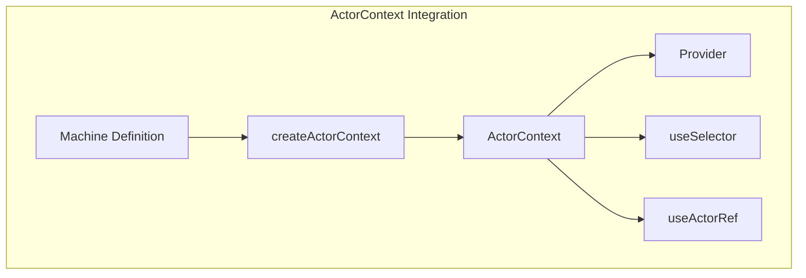
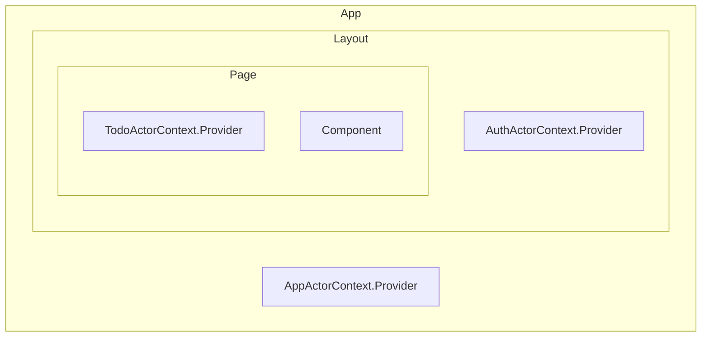
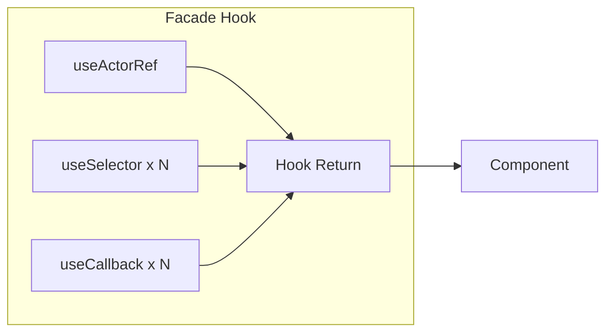
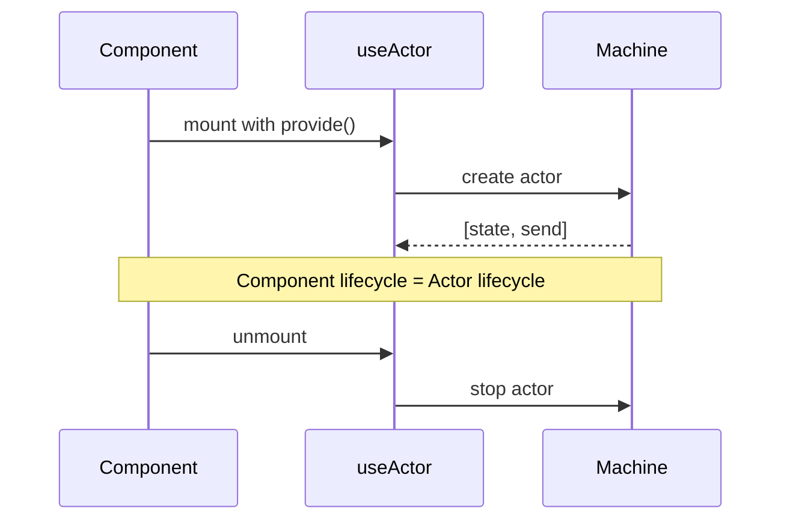

# React Binding Conventions

Conventions for integrating XState v5 with React using `@xstate/react`.

## File Naming Conventions

| Type | Pattern | Example |
|------|---------|---------|
| ActorContext | `<Name>ActorContext.ts` (PascalCase) | `TodoActorContext.ts` |

> **Note:** Machine file naming (`*.machine.ts`) is defined in [XState Conventions](./xstate-conventions.md#file-naming-conventions).


## ActorContext Pattern

### Basic Structure

Use `createActorContext()` to integrate with React Context.



```typescript
// TodoActorContext.ts
import { createActorContext } from '@xstate/react';
import todoMachine from './todo.machine';

const TodoActorContext = createActorContext(todoMachine);
export default TodoActorContext;
```

### Provider Placement Strategy

Place ActorContext Providers at the appropriate level based on the actor's scope.



| Scope | Provider Location | Use Case |
|-------|-------------------|----------|
| App-wide | Root layout | Global state (theme, auth) |
| Domain/Layout | Layout component | Feature-scoped state |
| Page-specific | Page component | Page-local state |

#### Example

```tsx
// App-wide (App.tsx)
<AppActorContext.Provider>
  <App />
</AppActorContext.Provider>

// Domain-scoped (DashboardLayout.tsx)
<AuthActorContext.Provider>
  <NotificationActorContext.Provider
    options={{ input: { userId } }}
  >
    {children}
  </NotificationActorContext.Provider>
</AuthActorContext.Provider>

// Page-scoped (TodoPage.tsx)
<TodoActorContext.Provider
  options={{ input: { initialItems } }}
>
  <TodoList />
</TodoActorContext.Provider>
```

### Passing Input

Use `options.input` to pass initial values.

```tsx
<TodoActorContext.Provider
  options={{
    input: {
      initialItems: []
    }
  }}
>
```


## Selector Pattern

### Placement

Define all selectors at the end of the machine definition file, after the default export.

```typescript
// todo.machine.ts

// 1. Machine definition
const todoMachine = setup({ /* ... */ }).createMachine({ /* ... */ });

export default todoMachine;

// ============================================================================
// Selectors
// ============================================================================

type TodoSnapshot = SnapshotFrom<typeof todoMachine>;

// 2. Basic selectors
export const selectItems = (snapshot: TodoSnapshot): readonly Item[] =>
  snapshot.context.items;

// 3. Derived selectors
export const selectStatus = (snapshot: TodoSnapshot): Status => { /* ... */ };
```

### Basic Selectors

Direct access to context values.

```typescript
import type { SnapshotFrom } from 'xstate';

type TodoSnapshot = SnapshotFrom<typeof todoMachine>;

export const selectError = (snapshot: TodoSnapshot): Error | null =>
  snapshot.context.error;

export const selectItems = (snapshot: TodoSnapshot): readonly Item[] =>
  snapshot.context.items;
```

### Derived Selectors

Return computed values from state using `snapshot.matches()`.

```typescript
export type Status = 'idle' | 'loading' | 'error';

export const selectStatus = (snapshot: TodoSnapshot): Status => {
  if (snapshot.matches('loading') || snapshot.matches('saving')) {
    return 'loading';
  }
  if (snapshot.matches('error')) {
    return 'error';
  }
  return 'idle';
};

// Nested state matching
export const selectFormStatus = (snapshot: FormSnapshot): FormStatus => {
  if (snapshot.matches({ form: { validation: 'invalid' } })) {
    return 'invalid';
  }
  return 'valid';
};
```

### Using Selectors with useSelector

```typescript
// In components
const status = TodoActorContext.useSelector(selectStatus);
const error = TodoActorContext.useSelector(selectError);

// Inline selector is also possible
const currentState = TodoActorContext.useSelector((snapshot) => snapshot.value);
```


## Facade Hook Pattern

Integrate multiple selectors and actions to provide a unified interface for UI components.



```typescript
export default function useTodos(): UseTodosResult {
  // Get ActorRef
  const todoActorRef = TodoActorContext.useActorRef();

  // State via selectors
  const status = TodoActorContext.useSelector(selectStatus);
  const items = TodoActorContext.useSelector(selectItems);
  const error = TodoActorContext.useSelector(selectError);

  // Action definitions
  const addItem = useCallback((title: string) => {
    todoActorRef.send({ type: 'item.added', title });
  }, [todoActorRef]);

  const removeItem = useCallback((id: string) => {
    todoActorRef.send({ type: 'item.removed', id });
  }, [todoActorRef]);

  const retry = useCallback(() => {
    todoActorRef.send({ type: 'retry.requested' });
  }, [todoActorRef]);

  return {
    status,
    items,
    error,
    addItem,
    removeItem,
    retry
  };
}
```


## Component 1:1 Lifecycle Pattern

Match the actor lifecycle to the component's mount/unmount lifecycle.
Use `useActor` directly instead of ActorContext.



### Use Cases

- Wizard or multi-step flows that complete within a component
- Multiple instances needed (e.g., multiple forms)
- No state sharing outside the component

### Implementation

```typescript
// wizard.machine.ts - Machine definition
// Define actors as placeholders, inject implementation via provide()
const wizardMachine = setup({
  types: {
    context: {} as Context,
    events: {} as Event,
    input: {} as Input
  },
  guards: {
    isStepValid: ({ context }) => context.currentStepData !== null,
    isComplete: ({ context }) => context.step === context.totalSteps
  },
  actors: {
    // Placeholder: Inject implementation via provide()
    stepValidator: fromPromise<boolean, StepData>(async () => {
      throw new Error('stepValidator must be provided');
    }),
    formSubmitter: fromPromise<Result, FormData>(async () => {
      throw new Error('formSubmitter must be provided');
    })
  }
}).createMachine({
  id: 'wizard',
  context: ({ input }) => ({
    step: 0,
    totalSteps: input.totalSteps,
    currentStepData: null,
    formData: {}
  }),
  initial: 'editing',
  states: {
    editing: { /* ... */ },
    validating: { /* ... */ },
    submitting: { /* ... */ },
    complete: { type: 'final' },
    error: { /* ... */ }
  }
});

export default wizardMachine;
```

```tsx
// WizardForm.tsx - Component usage
export default function WizardForm({ onComplete }: Props): ReactElement {
  const { validateStep, submitForm } = useFormApi();

  // Create actor with useActor (lifecycle matches component)
  // Inject actual actor implementations via provide()
  const [state, send] = useActor(
    wizardMachine.provide({
      actors: {
        stepValidator: fromPromise(({ input }) => validateStep(input)),
        formSubmitter: fromPromise(({ input }) => submitForm(input))
      }
    }),
    {
      input: {
        totalSteps: 3
      }
    }
  );

  const handleNext = () => {
    send({ type: 'next.clicked' });
  };

  const handleBack = () => {
    send({ type: 'back.clicked' });
  };

  if (state.matches('complete')) {
    onComplete();
    return null;
  }

  return (
    <div>
      <StepIndicator current={state.context.step} total={3} />
      <StepContent step={state.context.step} />
      <Button onClick={handleBack} disabled={state.context.step === 0}>Back</Button>
      <Button onClick={handleNext}>Next</Button>
    </div>
  );
}
```

### Comparison with ActorContext Pattern

| Aspect | ActorContext Pattern | Component 1:1 Pattern |
|--------|----------------------|----------------------|
| Actor creation | Once in Provider | On each component mount |
| Lifecycle | Follows Provider scope | Matches component |
| State sharing | Shared across children | Component-local only |
| Actor injection | Provider options | `provide()` |
| Use case | Cross-cutting state | Component-specific flows |


## Event Subscription Pattern

Subscribe to emitted events from other actors.

```typescript
useEffect(() => {
  const subscription = uploadActorRef.on('upload.completed', () => {
    fileListActorRef.send({ type: 'list.refreshRequested' });
  });
  return subscription.unsubscribe;
}, [uploadActorRef, fileListActorRef]);
```

**Important:** Always return `subscription.unsubscribe` in the cleanup function.
