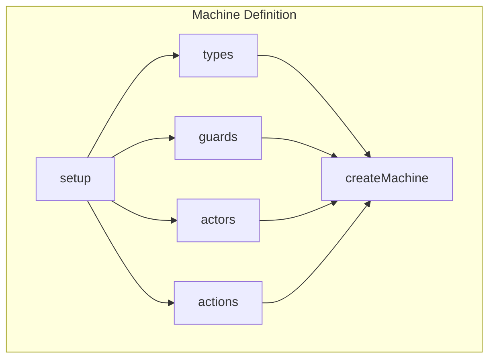
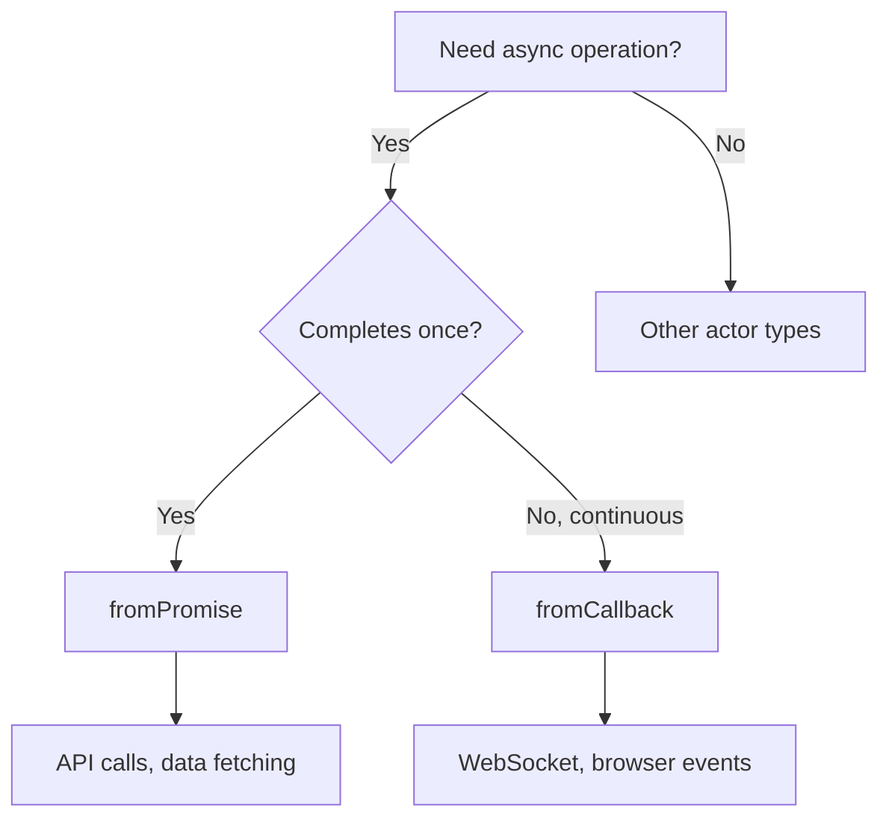
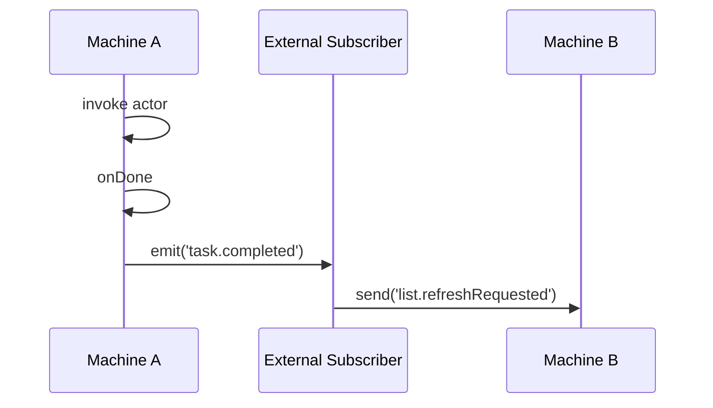
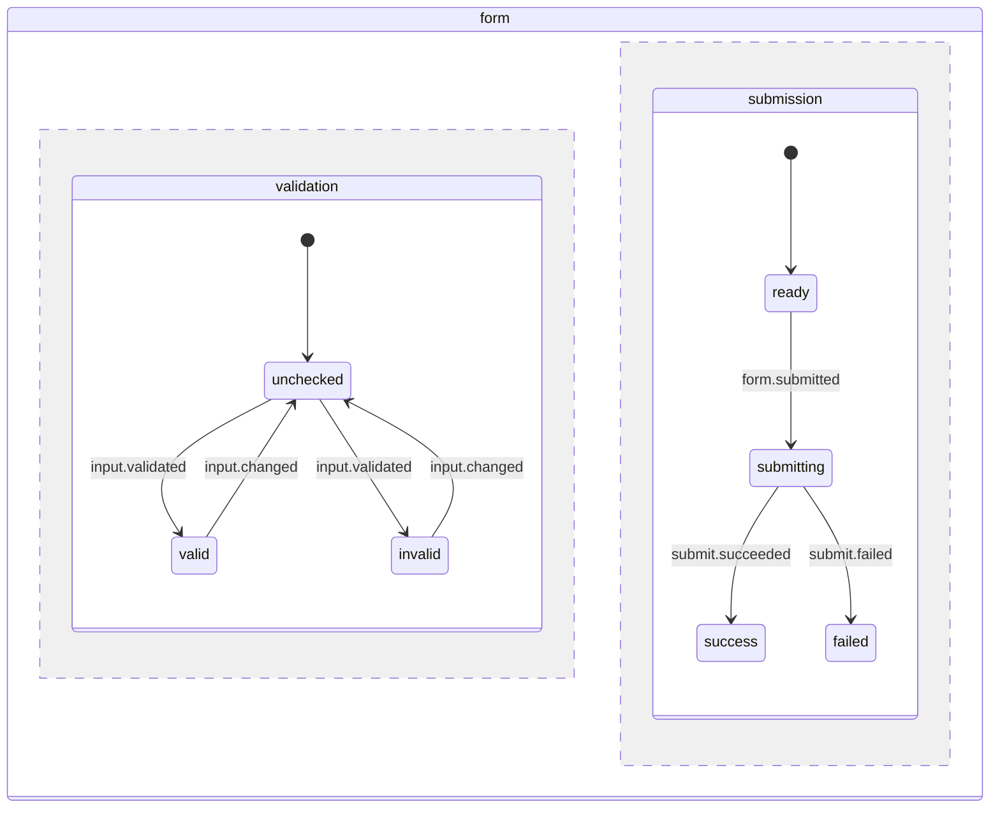

# XState Conventions

General conventions for XState v5 state machine design.

## File Naming Conventions

| Type | Pattern | Example |
|------|---------|---------|
| Machine definition | `<name>.machine.ts` (camelCase) | `todo.machine.ts` |
| Machine constant | `<name>Machine` (camelCase) | `todoMachine` |
| Selector function | `select<PropertyName>` (camelCase) | `selectItems`, `selectStatus` |


## Naming Conventions

> Reference: [State Machines - What's in a name?](https://stately.ai/blog/2024-01-23-state-machines-whats-in-a-name)

### Part of Speech Mapping

Each element uses a specific part of speech to clarify its purpose.

| Element | Part of Speech | Examples |
|---------|----------------|----------|
| **States** | Noun / Adjective | `idle`, `loading`, `authenticated`, `error` |
| **Events** | Past participle (dot.case recommended) | `form.submitted`, `data.loaded`, `error.occurred` |
| **Actions** | Verb phrase | `sendRequest`, `updateData`, `showError` |
| **Guards** | Adjective / Past participle | `isValid`, `hasData`, `isExpired` |
| **Parent States** | Compound noun | `editingProfile` |
| **Invoked Actors** | Noun / Gerund | `dataLoader`, `formValidator` |

### Event Naming with dot.case

Use `dot.case` for event names. This format enables wildcard transitions and groups related events.

```typescript
// Recommended: dot.case with past participle
type Event =
  | { type: 'form.submitted' }
  | { type: 'data.received'; data: Data }
  | { type: 'error.occurred'; error: Error }
  | { type: 'connection.changed'; status: ConnectionStatus };

// Wildcard transition example
on: {
  'form.*': {
    actions: 'logFormEvent'
  }
}
```

**Benefits:**
- Visually distinct from other elements
- Groups events by category (`form.*`, `data.*`)
- Enables wildcard transitions with `*`

### Naming Best Practices

1. **Be concise yet specific ("minimally meaningful")**
   - Bad: `State1`, `Event1`
   - Good: `idle`, `form.submitted`

2. **Maintain consistency**
   - If using `-ing` for states, apply to all states (`loading`, `saving`, `validating`)
   - If using `camelCase` for actions, apply to all actions

3. **Differentiate element styles**
   - States: `camelCase`
   - Events: `dot.case`


## Machine Definition Pattern

### Basic Structure

Use `setup()` to define actors, guards, and types. Use `createMachine()` to build the state chart.



```typescript
import { assign, fromPromise, setup } from 'xstate';

// Type definitions
interface Context {
  readonly items: Item[];
  readonly error: Error | null;
}

type Event =
  | { type: 'form.submitted'; data: FormData }
  | { type: 'retry.requested' };

interface Input {
  readonly initialItems: Item[];
}

// Machine definition
const todoMachine = setup({
  types: {
    context: {} as Context,
    events: {} as Event,
    input: {} as Input
  },
  guards: {
    hasItems: ({ context }) => context.items.length > 0
  },
  actors: {
    itemSaver: fromPromise<Item, FormData>(({ input }) =>
      saveItem(input)
    )
  }
}).createMachine({
  id: 'todo',
  initial: 'idle',
  context: ({ input }) => ({
    items: input.initialItems,
    error: null
  }),
  states: {
    idle: {
      on: { 'form.submitted': 'saving' }
    },
    saving: {
      invoke: {
        src: 'itemSaver',
        input: ({ event }) => event.data,
        onDone: {
          target: 'idle',
          actions: assign({
            items: ({ context, event }) => [...context.items, event.output]
          })
        },
        onError: {
          target: 'error',
          actions: assign({ error: ({ event }) => event.error as Error })
        }
      }
    },
    error: {
      on: { 'retry.requested': 'idle' }
    }
  }
});

export default todoMachine;
```


## Actor Implementation Patterns

### Choosing Actor Type

Select the appropriate actor factory based on the use case.



| Actor Type | Use Case | Examples |
|------------|----------|----------|
| `fromPromise` | Async operations that complete once | API calls, data fetching |
| `fromCallback` | Continuous event streams | WebSocket, browser events |

### fromPromise Pattern

Wrap a Promise-returning function. Use for data fetching and API calls.

```typescript
actors: {
  userLoader: fromPromise<User, string>(({ input: userId }) =>
    fetch(`/api/users/${userId}`).then(res => res.json())
  ),
  formSubmitter: fromPromise<Result, FormData>(({ input }) =>
    submitForm(input)
  )
}
```

### fromCallback Pattern

Use for continuous event emission (WebSocket, browser events).

```typescript
actors: {
  connectionObserver: fromCallback<ConnectionEvent>(({ sendBack }) => {
    const handleOnline = () => sendBack({ type: 'connection.changed', status: 'online' });
    const handleOffline = () => sendBack({ type: 'connection.changed', status: 'offline' });

    window.addEventListener('online', handleOnline);
    window.addEventListener('offline', handleOffline);

    // Return cleanup function
    return () => {
      window.removeEventListener('online', handleOnline);
      window.removeEventListener('offline', handleOffline);
    };
  })
}
```

**Important:** Always return a cleanup function to prevent memory leaks.


## Guard Definition Patterns

### Basic Guards

Consolidate condition logic in `guards` to improve transition readability.

```typescript
guards: {
  // Context-based check
  hasItems: ({ context }) => context.items.length > 0,

  // Event-based check
  isValidInput: ({ event }) => event.data.trim().length > 0
}
```

### Parameterized Guards

Use `params` for dynamic condition evaluation.

```typescript
guards: {
  isConfirmed: (_: unknown, params: { result: DialogResult }): boolean => {
    return params.result === 'confirmed';
  }
}
```

Usage in transitions:

```typescript
onDone: [
  {
    guard: {
      type: 'isConfirmed',
      params: ({ event }) => ({ result: event.output })
    },
    target: 'deleting'
  },
  {
    target: 'idle'
  }
]
```


## Actor Communication Patterns

### Event Emission with emit

Emit events from a machine to external subscribers.



```typescript
const uploadMachine = setup({
  types: {
    emitted: {} as { type: 'upload.completed'; fileId: string }
  }
}).createMachine({
  states: {
    uploading: {
      invoke: {
        src: 'fileUploader',
        onDone: {
          target: 'idle',
          actions: emit(({ event }) => ({
            type: 'upload.completed',
            fileId: event.output.id
          }))
        }
      }
    }
  }
});
```

### Subscribing with actor.on()

```typescript
useEffect(() => {
  const subscription = uploadActorRef.on('upload.completed', (event) => {
    fileListActorRef.send({ type: 'list.refreshRequested' });
  });
  return subscription.unsubscribe;
}, [uploadActorRef, fileListActorRef]);
```

**Benefits:**
- Loose coupling: Actors don't need direct references
- Testability: Event-based communication is easier to mock
- Flexibility: Subscribers can be added/removed without modifying emitter


## Parallel States

Manage multiple independent states simultaneously.



```typescript
states: {
  form: {
    type: 'parallel',
    states: {
      validation: {
        initial: 'unchecked',
        states: {
          unchecked: {
            on: {
              'input.validated': [
                { guard: 'isValid', target: 'valid' },
                { target: 'invalid' }
              ]
            }
          },
          valid: { on: { 'input.changed': 'unchecked' } },
          invalid: { on: { 'input.changed': 'unchecked' } }
        }
      },
      submission: {
        initial: 'ready',
        states: {
          ready: { on: { 'form.submitted': 'submitting' } },
          submitting: {
            invoke: {
              src: 'formSubmitter',
              onDone: 'success',
              onError: 'failed'
            }
          },
          success: { type: 'final' },
          failed: { on: { 'retry.requested': 'ready' } }
        }
      }
    }
  }
}
```


## Global Event Handling

Define common event handling at the root level with `on`.

```typescript
createMachine({
  on: {
    // Events accepted in all states
    'theme.changed': {
      actions: assign({
        theme: ({ event }) => event.theme
      })
    },
    // Events with state transitions
    'session.expired': {
      target: '.idle',
      actions: 'clearSession'
    }
  }
})
```


## Type Definition Rules

### Type Naming Convention

Use simple, module-scoped type names without prefixes.

| Type Purpose | Name | Form |
|--------------|------|------|
| Machine context | `Context` | interface |
| Machine events | `Event` | type alias (union) |
| Machine input | `Input` | interface |
| Emitted events | `EmittedEvent` | type alias |

**Exception:** If `Event` conflicts with the global DOM `Event` type, use `MachineEvent`.

### Declaration Order

Declare types in the same order as they appear in `setup({ types: { ... } })`:

1. `Context`
2. `Event` (or `MachineEvent`)
3. `Input`
4. `EmittedEvent`

### Export Policy

- Do NOT export types that are only used internally
- Only export types consumed by other modules
- TypeScript can infer types from selectors and functions

```typescript
// Internal types - do NOT export
interface Context {
  readonly items: Item[];
  readonly error: Error | null;
}

type Event =
  | { type: 'item.added'; item: Item }
  | { type: 'item.removed'; id: string };

// Export only the machine
export default todoMachine;
```


## State Definition Order

### Rule: Define `idle` First, `error` Last

Follow a consistent ordering convention for common state names.

1. **`idle` state:** Always define as the **first** state
2. **`error` state:** Always define as the **last** state
3. **Other states:** Define between `idle` and `error` in logical flow order

```typescript
const fetchMachine = setup({
  // ...
}).createMachine({
  id: 'fetch',
  initial: 'idle',
  states: {
    // 1. idle - always first
    idle: {
      on: { 'fetch.requested': 'loading' }
    },

    // 2. Other states - in logical flow order
    loading: {
      invoke: {
        src: 'dataLoader',
        onDone: 'success',
        onError: 'error'
      }
    },
    success: {
      on: { 'refresh.requested': 'loading' }
    },

    // 3. error - always last
    error: {
      on: { 'retry.requested': 'loading' }
    }
  }
});
```


## Test Strategy

### What NOT to Test

State machine definitions are declarative specifications. Testing transitions is redundant.

```typescript
// Redundant: This just restates the machine definition
it('should transition to loading on fetch.requested', () => {
  const actor = createActor(fetchMachine);
  actor.start();
  actor.send({ type: 'fetch.requested' });
  expect(actor.getSnapshot().matches('loading')).toBe(true);
});
```

### What to Test

| Target | Priority | Reason |
|--------|----------|--------|
| Actor implementations (fromPromise, fromCallback) | High | Side effects need verification |
| Complex guards | Medium | Business logic validation |
| Derived selectors | Medium | Computation correctness |
| Component integration | High | User-facing behavior |

### Actor Implementation Tests

```typescript
describe('saveItem', () => {
  it('should return saved item with id', async () => {
    const result = await saveItem({ title: 'Test' });
    expect(result.id).toBeDefined();
    expect(result.title).toBe('Test');
  });

  it('should throw on invalid data', async () => {
    await expect(saveItem({ title: '' })).rejects.toThrow(ValidationError);
  });
});
```

### Integration Tests

Verify machine behavior through component integration tests or E2E tests.

```typescript
describe('TodoList', () => {
  it('should display items after loading', async () => {
    render(<TodoList />);
    await waitFor(() => {
      expect(screen.getByText('Buy groceries')).toBeInTheDocument();
    });
  });

  it('should add new item on form submit', async () => {
    render(<TodoList />);
    await userEvent.type(screen.getByRole('textbox'), 'New task');
    await userEvent.click(screen.getByRole('button', { name: 'Add' }));
    await waitFor(() => {
      expect(screen.getByText('New task')).toBeInTheDocument();
    });
  });
});
```
