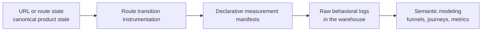
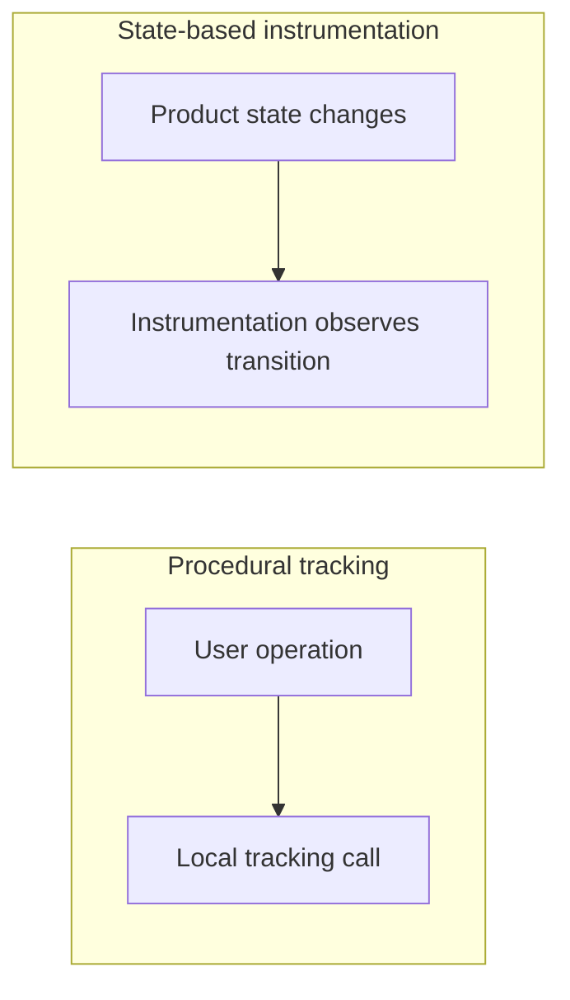
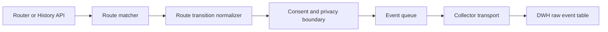
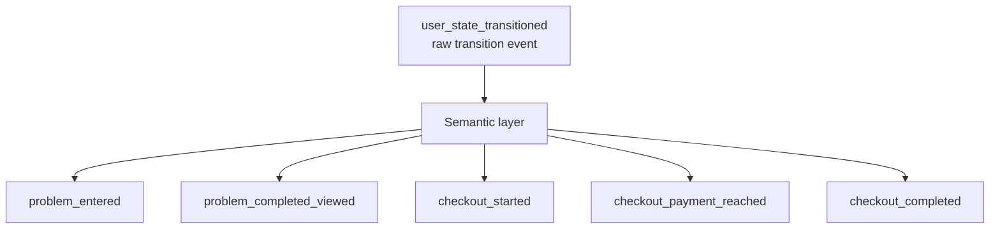

# Route-State-Based Product Analytics

A URL-first pattern for deriving analytics from canonical route transitions.

## Status

This reference describes a personal web architecture pattern. It is not a
vendor standard, a W3C standard, or a product analytics tool specification.

Use it as a design lens for web products where product analytics, URL design,
information architecture, and downstream data modeling need to be coherent.

## Core Thesis

Product analytics should be derived from canonical product state transitions,
not scattered UI-side tracking calls.

The strongest web version of this pattern is:



The goal is not to make `track(...)` safer. The goal is to avoid making product
code call `track(...)` for durable product metrics.

## Problem

The common implementation pattern is to call analytics SDKs directly from UI
handlers:

```tsx
function SubmitButton() {
  return (
    <button
      onClick={() => {
        ga("event", "click_submit_button", {
          screen: "checkout",
        });

        submitOrder();
      }}
    >
      Submit
    </button>
  );
}
```

This is fragile because the analytics event is coupled to:

- a particular component
- a particular DOM or UI interaction
- a transient implementation structure
- a local developer's event naming choice
- the current shape of the UI flow

The product question is usually not "was this button clicked?" It is usually:

- Did checkout start?
- Did the user reach payment?
- Did order submission succeed?
- Where did the user leave the flow?
- Which route sequences correlate with conversion or failure?

Button clicks can be useful for temporary UX research, but they are a weak
source of truth for durable product analytics.

## Architecture Levels

Use this ladder to classify a tracking design.

| Level | Pattern | Assessment |
|---|---|---|
| 1 | UI-side SDK calls | Easy to start, weak under refactoring |
| 2 | Typed analytics abstraction | Safer API, still procedural |
| 3 | Application event projection | Better separation, still depends on explicit event emission |
| 4 | State transition projection | Analytics derived from explicit finite state changes |
| 5 | Route-state raw collection with DWH semantic modeling | Strongest when URL or route state is a stable product-state contract |

The main transition is from procedural tracking to observed product-state transitions:



## URL as Product State SSOT

In a web application, the URL can be more than a routing implementation detail.
It can be the canonical representation of the user's current product-visible
state.

Good URL-state examples:

```text
/courses/:courseId/lessons/:lessonId
/courses/:courseId/lessons/:lessonId/problems/:problemId
/courses/:courseId/lessons/:lessonId/problems/:problemId/result
/checkout/shipping
/checkout/payment
/checkout/review
/checkout/complete
```

Weak URL-state examples:

```text
/app
/dashboard
/workspace/123
/page?id=123&type=problem&mode=result
```

The difference is not aesthetics. A strong URL preserves product meaning in the
raw log. A weak URL forces the data layer to recover meaning that may no longer
exist in the event.

## IA Contract

Route design is an information architecture contract.

When route transitions are used as analytics source data, routes must be
understandable outside engineering. Product owners, designers, customer support,
and analysts should be able to read a route registry and understand the user's
state.

Minimum route registry fields:

| Field | Purpose |
|---|---|
| `route_name` | Stable machine identifier |
| `url_pattern` | Canonical URL pattern |
| `required_params` | Required path parameters |
| `optional_query_params` | Supported query-state parameters |
| `user_meaning` | What this state means to a user |
| `analytics_meaning` | What this state means analytically |
| `pii_policy` | Whether params or query values may contain PII |
| `canonicalization_rule` | How equivalent URLs collapse to one state |
| `deprecated` | Whether this route is retained only for compatibility |

Example:

```yaml
routes:
  problem:
    url_pattern: "/courses/:courseId/lessons/:lessonId/problems/:problemId"
    required_params:
      - courseId
      - lessonId
      - problemId
    optional_query_params:
      - tab
    user_meaning: "The learner is working on a problem."
    analytics_meaning: "Problem practice is active."
    pii_policy:
      path_params: "non_pii_ids_only"
      query_params: "allowlist_only"
    canonicalization_rule: "drop unknown query params; sort query params"
    deprecated: false
```

## Raw Route Transition Event

The raw event should describe the state transition. It should not prematurely
encode a business metric.

Representative TypeScript shape:

```ts
type UserStateTransitionEvent = {
  event_name: "user_state_transitioned";

  from_state: {
    url: string | null;
    route_name: string | null;
    params: Record<string, string>;
    query: Record<string, string>;
  };

  to_state: {
    url: string;
    route_name: string;
    params: Record<string, string>;
    query: Record<string, string>;
  };

  transition: {
    type: "push" | "replace" | "pop";
    cause?: "link" | "form_submit" | "redirect" | "browser_back" | "unknown";
  };

  context: {
    session_id: string;
    anonymous_id: string;
    user_id?: string;
    app_version: string;
    locale: string;
  };

  occurred_at: string;
};
```

This single event type can support:

- funnels
- drop-off analysis
- return-path analysis
- loop detection
- search-to-route analysis
- back-button analysis
- route graph analysis
- activation and conversion path modeling

## Runtime Architecture

Use a small runtime instrumentation boundary:



Feature code should update product state and route state. It should not know
which analytics event will eventually be produced from that transition.

## Declarative Measurement Manifest

Semantic analytics events can be derived from raw route transitions by a
manifest.

Example route registry:

```yaml
routes:
  lesson:
    path: "/courses/:courseId/lessons/:lessonId"

  problem:
    path: "/courses/:courseId/lessons/:lessonId/problems/:problemId"

  problem_result:
    path: "/courses/:courseId/lessons/:lessonId/problems/:problemId/result"
```

Example measurement manifest:

```yaml
measurements:
  - id: problem_entered
    source: route_transition
    when:
      to_route: problem
    emit:
      name: "problem_entered"
      properties:
        course_id: "$to.params.courseId"
        lesson_id: "$to.params.lessonId"
        problem_id: "$to.params.problemId"

  - id: problem_completed_viewed
    source: route_transition
    when:
      from_route: problem
      to_route: problem_result
    emit:
      name: "problem_completed_viewed"
      properties:
        course_id: "$to.params.courseId"
        lesson_id: "$to.params.lessonId"
        problem_id: "$to.params.problemId"
```

The frontend runtime may evaluate this manifest, or the DWH semantic layer may
apply the same rules later. The important property is that measurement logic is
declared against canonical states, not scattered through UI code.

## Frontend Implementation Example

A frontend implementation can keep feature code unaware of analytics. Feature
code changes route state; the instrumentation layer observes router transitions,
normalizes them, emits one raw transition event, and optionally projects
semantic events from the measurement manifest.

```ts
type RouteName = "lesson" | "problem" | "problem_result";

type RouteSnapshot = {
  url: string;
  routeName: RouteName;
  params: Record<string, string>;
  query: Record<string, string>;
};

type RouteTransition = {
  from: RouteSnapshot | null;
  to: RouteSnapshot;
  transition: {
    type: "push" | "replace" | "pop";
    cause: "link" | "form_submit" | "redirect" | "browser_back" | "unknown";
  };
  occurredAt: string;
};

type MeasurementRule = {
  id: string;
  when: {
    fromRoute?: RouteName;
    toRoute?: RouteName;
  };
  emit: {
    name: string;
    properties: Record<string, string>;
  };
};

type RouterLike = {
  subscribe(
    listener: (change: {
      url: string;
      type: RouteTransition["transition"]["type"];
    }) => void,
  ): void;
};

type Collector = {
  send(event: unknown): void;
};

const routePatterns = {
  lesson: "/courses/:courseId/lessons/:lessonId",
  problem: "/courses/:courseId/lessons/:lessonId/problems/:problemId",
  problem_result: "/courses/:courseId/lessons/:lessonId/problems/:problemId/result",
} as const;

const measurements: MeasurementRule[] = [
  {
    id: "problem_entered",
    when: { toRoute: "problem" },
    emit: {
      name: "problem_entered",
      properties: {
        course_id: "$to.params.courseId",
        lesson_id: "$to.params.lessonId",
        problem_id: "$to.params.problemId",
      },
    },
  },
  {
    id: "problem_completed_viewed",
    when: { fromRoute: "problem", toRoute: "problem_result" },
    emit: {
      name: "problem_completed_viewed",
      properties: {
        course_id: "$to.params.courseId",
        lesson_id: "$to.params.lessonId",
        problem_id: "$to.params.problemId",
      },
    },
  },
];

export function installRouteStateInstrumentation(input: {
  router: RouterLike;
  collector: Collector;
  context: {
    sessionId: string;
    anonymousId: string;
    userId?: string;
    appVersion: string;
    locale: string;
  };
}) {
  let previous: RouteSnapshot | null = null;

  input.router.subscribe((change) => {
    const to = matchRoute(change.url, routePatterns);
    const transition: RouteTransition = {
      from: previous,
      to,
      transition: {
        type: change.type,
        cause: inferNavigationCause(change),
      },
      occurredAt: new Date().toISOString(),
    };

    input.collector.send(toRawTransitionEvent(transition, input.context));

    for (const event of evaluateMeasurements(transition, measurements)) {
      input.collector.send({
        ...event,
        context: input.context,
        occurred_at: transition.occurredAt,
      });
    }

    previous = to;
  });
}

function evaluateMeasurements(
  transition: RouteTransition,
  rules: MeasurementRule[],
) {
  return rules
    .filter((rule) => matchesTransition(rule, transition))
    .map((rule) => ({
      event_name: rule.emit.name,
      measurement_id: rule.id,
      properties: resolveProperties(rule.emit.properties, transition),
    }));
}

function matchesTransition(rule: MeasurementRule, transition: RouteTransition) {
  const fromMatches =
    rule.when.fromRoute === undefined ||
    transition.from?.routeName === rule.when.fromRoute;
  const toMatches =
    rule.when.toRoute === undefined ||
    transition.to.routeName === rule.when.toRoute;

  return fromMatches && toMatches;
}

function resolveProperties(
  properties: Record<string, string>,
  transition: RouteTransition,
) {
  return Object.fromEntries(
    Object.entries(properties).map(([name, expression]) => [
      name,
      resolveExpression(expression, transition),
    ]),
  );
}
```

The omitted helpers are intentionally isolated:

- `matchRoute` owns route-pattern matching and canonical query filtering.
- `inferNavigationCause` classifies navigation causes without involving feature
  components.
- `toRawTransitionEvent` shapes the stable warehouse event.
- `resolveExpression` reads only allowlisted paths such as `$to.params.courseId`.

The important boundary is that product features only navigate to canonical
routes. They do not call analytics SDKs for durable metrics.

## Raw Layer and Semantic Layer

Prefer a two-layer model:



The raw layer should be stable, minimal, privacy-reviewed, and hard to break
through UI refactors.

The semantic layer can evolve as product questions change. It can live in:

- frontend declarative instrumentation
- backend event processing
- ETL
- dbt models
- warehouse views
- a governed metrics or semantic layer

## Query Parameter Policy

Query params can be part of product state, but only when they are intentional.

Good query-state examples:

```text
?tab=comments
?step=payment
?filter=unanswered
?sort=recent
```

Risky query-state examples:

```text
?modal=true
?tmp=abc
?debug=1
?email=user@example.com
?q=freeform-user-input
```

Use an allowlist. Treat unknown query params as non-canonical unless the route
registry explicitly says otherwise.

## Non-Route Sources

URL and route transitions do not capture every meaningful product fact.

Route state is strong for:

- page or screen transitions
- step transitions
- tab changes
- target resource changes
- filters
- sort order
- detail target changes

Route state is weak for:

- form input start
- validation failure
- answer submission
- API success or failure
- background sync
- media playback progress
- drag interactions
- temporary UI state

Do not solve these gaps by scattering analytics calls. Add explicit
instrumentation sources.

Example:

```yaml
sources:
  - type: router

  - type: state_machine
    id: problem_session

  - type: form
    id: answer_form
```

Example measurement rules:

```yaml
measurements:
  - id: answer_submitted
    source: state_machine_transition
    machine: problem_session
    when:
      from: answering
      to: submitted
    emit:
      name: "answer_submitted"
      properties:
        problem_id: "$context.problemId"
        answer_type: "$context.answerType"

  - id: answer_validation_failed
    source: state_machine_transition
    machine: problem_session
    when:
      to: validation_failed
    emit:
      name: "answer_validation_failed"
      properties:
        problem_id: "$context.problemId"
        reason: "$context.validationReason"
```

## Responsibility Boundaries

Keep responsibilities explicit:

| Layer | Responsibility |
|---|---|
| Feature code | Update product state and route state correctly |
| Router | Maintain canonical route transitions |
| Route registry | Define stable state names and meanings |
| Instrumentation runtime | Observe transitions and send raw events |
| Measurement manifest | Declare semantic interpretation rules |
| Collector | Handle consent, privacy, batching, retry, and transport |
| DWH raw table | Preserve raw transition history |
| Semantic model | Produce funnels, journeys, metrics, and named events |

## Privacy and Consent

PII means Personally Identifiable Information. In this pattern, treat PII as any
information that can identify, distinguish, trace, or be linked to a specific
person, either by itself or when combined with other data. This follows the NIST
CSRC glossary definition of [personally identifiable information](https://csrc.nist.gov/glossary/term/personally_identifiable_information).

For route-state analytics, PII risk is not limited to obvious values like email
addresses or names. Search terms, free-form query parameters, order IDs, account
IDs, or lesson/problem IDs can become linkable identifiers depending on the data
model and access controls.

The instrumentation boundary must enforce privacy rules before transport.

Minimum controls:

- consent gate before sending analytics events
- allowlisted route params and query params
- PII classification for every route parameter
- canonicalization that drops unknown or unsafe query params
- redaction for sensitive values
- explicit policy for authenticated and anonymous identifiers
- stable event schema with versioning

Never rely on individual feature authors to remember privacy filtering inside
local tracking calls.

## Design Heuristics

Prefer route-state instrumentation when:

- the product has meaningful URL states
- important user journeys are represented by route transitions
- non-engineers must understand journey logs
- refactoring resistance matters
- the warehouse is the main analytics modeling environment

Prefer state-machine instrumentation when:

- the flow has finite states that are not all represented in the URL
- success, failure, retry, or validation paths matter
- the UI can trigger the same behavior from multiple controls

Allow component-level tracking only when:

- the event is temporary
- the event supports an experiment or UX investigation
- the event is not a durable KPI source
- privacy and naming policy still apply

## Anti-Patterns

Avoid:

- direct `ga(...)`, `gtag(...)`, `posthog.capture(...)`, or `analytics.track(...)`
  calls from durable UI handlers
- event names that encode implementation details such as `submit_button_click`
- screen names based on component, class, or file names
- route names that only engineers can understand
- query params that carry free-form user input into analytics
- semantic analytics events without a documented source transition
- DWH models that recover product meaning from opaque URLs
- autocapture as the source of truth for durable metrics

## Review Checklist

Use these questions when reviewing a web app:

- Is the URL or route state a meaningful product-state representation?
- Does each route have a stable route name?
- Can non-engineers understand the route registry?
- Are route params and query params classified for PII risk?
- Are unknown query params dropped or isolated?
- Is there one raw transition event for route movement?
- Is the raw event stable across UI refactors?
- Are semantic events derived from route transitions or explicit state
  transitions?
- Are durable metrics free from component-level tracking dependencies?
- Are route-unobservable facts represented by state machines, domain events, or
  form/media lifecycle sources?
- Is consent enforced at the instrumentation boundary?
- Can DWH models reproduce funnels and journeys from raw transition data?

## Decision Template

Use this structure for architecture recommendations:

```text
Decision:
  Adopt route-state-based product analytics for durable web behavior metrics.

Canonical state:
  URLs and route names are the primary product-state representation.

Raw event:
  user_state_transitioned

Semantic derivation:
  Measurement manifests or DWH models derive named analytics events.

Non-route gaps:
  State machines, domain events, form lifecycle, or media lifecycle sources.

Boundaries:
  Router owns transitions.
  Instrumentation owns observation and transport.
  DWH owns long-term semantic modeling.

Risks:
  Weak IA naming, unsafe query params, ambiguous route semantics, incomplete
  non-route sources.
```

## Core Summary

URL design is not only navigation design. In this pattern, URL design is the
product's public state vocabulary.

Route transition logs are not just pageview logs. They are the movement history
through the product's information architecture.

Product analytics is the layer that turns that movement history into decisions.
